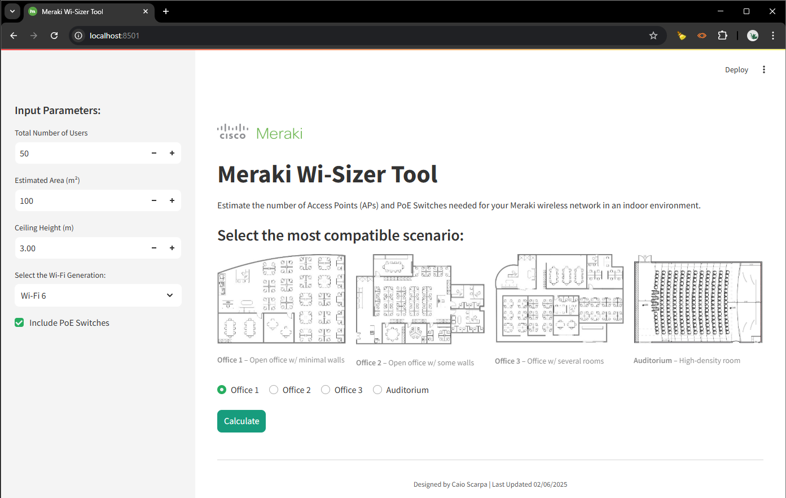
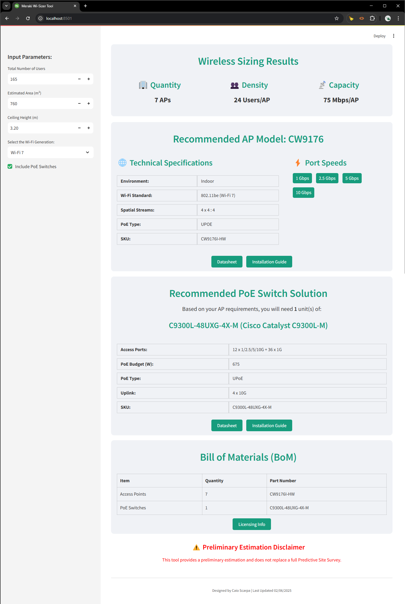

# Meraki Wi-Sizer Tool

## Overview
The Meraki Wi-Sizer Tool is a web-based application built to **estimate the required number of Meraki Access Points (APs) for a given indoor office environment**. This tool provides a preliminary wireless sizing estimation based on area, user density, and predefined scenarios, helping users make data-driven decisions about their Meraki wireless deployments on bugdetary stage.

## Features
- **Scenario-Based AP Estimation** – Choose from predefined office layouts to determine the number of APs required.
- **Wi-Fi Generation Selection** – Supports Wi-Fi 6, Wi-Fi 6E, and Wi-Fi 7 for accurate model recommendations.
- **AP Model Recommendations** – Suggests the best Meraki AP model based on user density and bandwidth needs.
- **PoE Switch Integration** – Optionally recommends PoE switches to power APs based on power and bandwidth requirements.

## Technologies Used
- **Python 3**
- **Streamlit** (for the UI)
- **Pandas** (for data handling)
- **JSON** (for storing details)

## How to Use
1. Select the relevant input parameters:
   - Number of users
   - Estimated area (m²)
   - Ceiling height (m)
   - Scenario selection (Office 1, Office 2, Office 3, Auditorium)
   - Wi-Fi generation (Wi-Fi 6, Wi-Fi 6E, Wi-Fi 7)
   - Option to include PoE switches
   - 

2. Click **Calculate** to get AP and switch recommendations.
   - 

## Project Structure
```
wi-sizer/
│── README.md   
│── data/
│   ├── ap_models.py
│   ├── scenarios.py
│   ├── switch_models.py
│── images/
│── requirements.txt    
│── wi-sizer.py               
```

## References
This project was developed based on several key references and best practices:
- [Campus LAN and Wireless LAN Solution Design Guide](https://www.cisco.com/c/en/us/td/docs/solutions/CVD/Campus/cisco-campus-lan-wlan-design-guide.html)
- [Cisco Live Presentations](https://www.ciscolive.com/on-demand/on-demand-library.html#/)
- [Cisco High Density Wireless Design](https://www.youtube.com/watch?v=c8w6Mfck0nQ)
- [Cisco Wireless Competitive Assessment - Miercom](https://miercom.com/wp-content/uploads/2024/10/Miercom-Cisco-Wireless-DR240115E.pdf)
- [Meraki Campus LAN; Planning, Design Guidelines and Best Practices](https://documentation.meraki.com/MS/Meraki_Campus_LAN%3B_Planning%2C_Design_Guidelines_and_Best_Practices)
- [High Density Wi-Fi Deployments](https://documentation.meraki.com/Architectures_and_Best_Practices/Cisco_Meraki_Best_Practice_Design/Best_Practice_Design_-_MR_Wireless/High_Density_Wi-Fi_Deployments)
- [Meraki Wireless for Enterprise Best Practices- RF Design](https://documentation.meraki.com/Architectures_and_Best_Practices/Meraki_Wireless_for_Enterprise_Best_Practices/Meraki_Wireless_for_Enterprise_Best_Practices-_RF_Design)

## License
This project is licensed under the MIT License.

## Disclaimer
This tool provides a **preliminary estimation** and **doesn't replace a professional predictive site survey**. It should be used only for initial sizing and budgetary purposes.

## Author
Developed by **Caio Scarpa**
